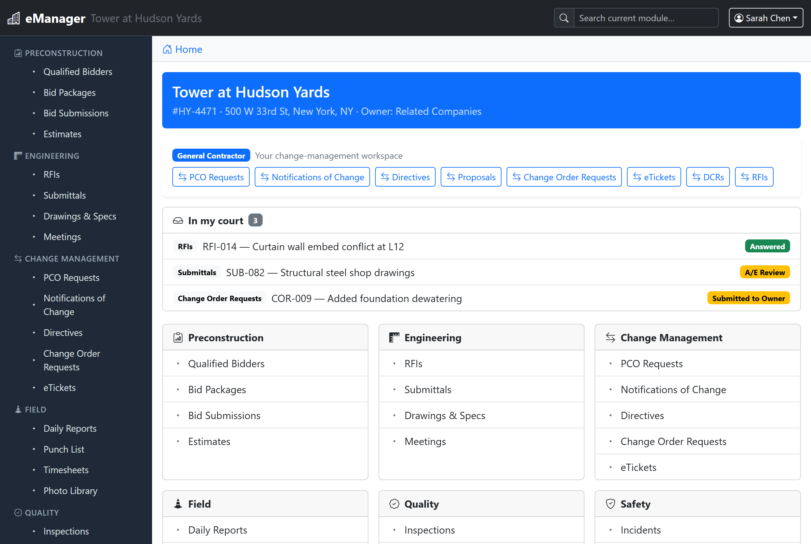
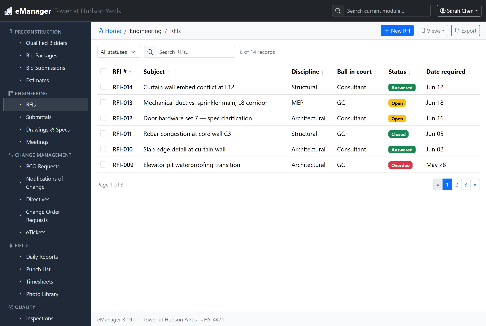
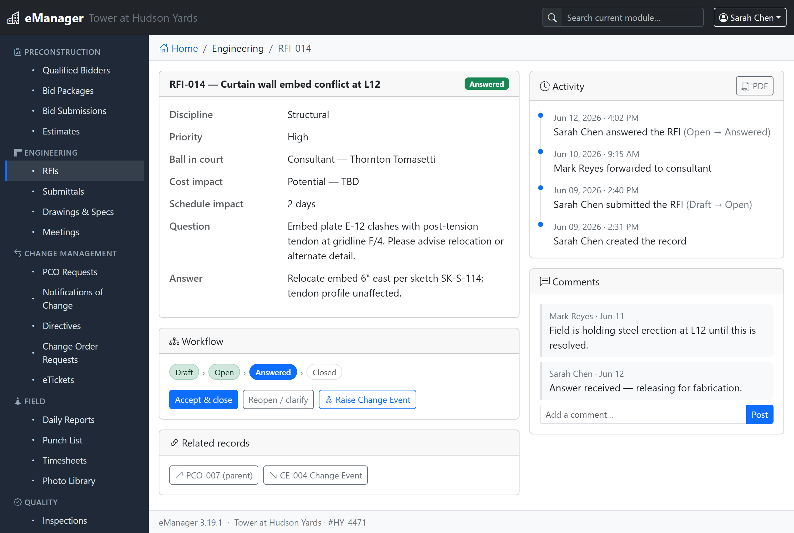
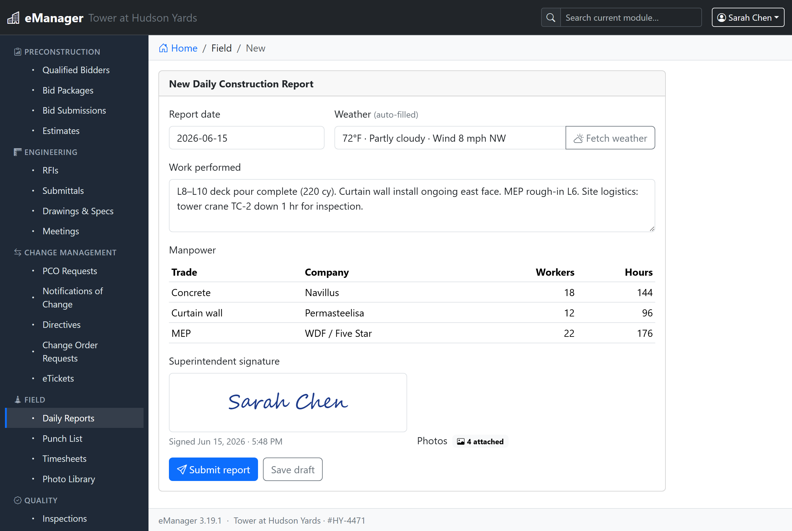

# eManager — Construction Management Dashboard for WordPress

> A general-contracting portal for mega projects. eManager turns a WordPress site into a
> complete construction-management dashboard — connecting the GC, owner, owner's rep,
> consultants and subcontractors on one site, with a role-gated change-order workflow and
> 100+ config-driven modules stored in native WordPress database tables.

<p>
  
  
  
  
</p>

**Repository:** https://github.com/eManagerNYC/WPEmanager



---

## What it does

Every business process on a jobsite — RFIs, submittals, daily reports, change orders, pay
applications, inspections, closeout — is a **module** described by a single `module.json`
file and stored in its **own table** in the WordPress database. One shared engine renders
every module's list / form / record pages and drives a **role-gated workflow state machine**,
so the platform stays lightweight and you can add modules **without writing PHP**.

- **100+ built-in modules** across 14 sections (preconstruction, engineering, change
  management, field, quality, safety, sustainability, contracts, cost, BIM, closeout,
  resources, reports).
- **Role-gated change-order workflow** — PCO Request → NOC → Directive → Proposal →
  COR/AL → eTicket, each step gated by the acting party's role and written to an audit trail.
- **AIA G702/G703 pay applications**, a budget-vs-committed-vs-actual-vs-forecast **cost
  roll-up**, Gantt + Line-of-Balance scheduling.
- **Two role dimensions** — five CRUD capability roles *and* five project party roles
  (GC, Owner, Owner's Rep, Consultant, Subcontractor) that drive the workflow logic gates.
- **Saved views, bulk actions, "In my court" queue, email notifications, Media Library
  attachments, auto-numbering, related-record linking** built on top of the engine.
- **No external services** — all data lives in custom tables in your WordPress database.

| | | |
|---|---|---|
|  |  |  |
| Sortable/filterable lists | Workflow + activity + comments | Forms with weather & signature |

---

## Requirements

| | |
|---|---|
| WordPress | 6.4 or newer |
| PHP | 8.0 or newer |
| Database | The WordPress site database (MySQL 5.7+/MariaDB 10.3+) — no external services |
| Browser | Any modern evergreen browser |

---

## Installation

### Option A — Install the packaged plugin (site owners)

1. Download the latest **`emanager-<version>.zip`** from the
   [Releases](https://github.com/eManagerNYC/WPEmanager/releases) page.
   *(No release yet? Build one — see Option B.)*
2. In WordPress: **Plugins → Add New → Upload Plugin**, choose the ZIP, and **Install Now**.
3. Click **Activate**. On activation eManager automatically:
   - creates all database tables (one per module + shared tables), via `dbDelta`;
   - adds the roles `em_administrator`, `em_editor`, `em_contributor`, `em_viewer`, `em_restricted`;
   - creates the pages **eManager Dashboard** (`[emanager]`), **Login** (`[emanager_login]`)
     and **Register** (`[emanager_register]`).
4. Go to **eManager → Settings** and enter the project info (name, number, address, and the
   coordinates used for weather). No connection setup is required.
5. Under **eManager → Users**, give each user an eManager role, a **party role** and a company
   (manage companies under **eManager → Companies**).
6. Open the **eManager Dashboard** page.

> **Upgrading or changed tables?** Use **eManager → Settings → Rebuild tables** — it re-runs
> `dbDelta` (applies only differences, never drops data).

### Option B — Install from source

The plugin lives entirely in the [`emanager/`](emanager/) folder; everything else in the repo
is build/test tooling that is **not** shipped.

```bash
git clone https://github.com/eManagerNYC/WPEmanager.git
cd WPEmanager
```

Then either:

**Symlink/copy the plugin folder** into your WordPress install and activate it:

```bash
# from your WordPress install
cp -r /path/to/WPEmanager/emanager wp-content/plugins/emanager
# (or symlink it for development)
```

**…or build the distributable ZIP** and upload it via Option A:

```bash
# macOS / Linux
cd WPEmanager && zip -r emanager-3.19.1.zip emanager
```

```powershell
# Windows PowerShell
Compress-Archive -Path emanager -DestinationPath emanager-3.19.1.zip -Force
```

### Option C — WP-CLI

```bash
wp plugin install /path/to/emanager-3.19.1.zip --activate
```

---

## First steps after activation

1. **eManager → Settings** — project name/number/address, coordinates (for Daily Report
   weather), notification toggle, and per-section access by party role.
2. **eManager → Companies** — add the GC, owner, consultants and subcontractors.
3. **eManager → Users** — assign each user a capability role **and** a party role; the party
   role decides which workflow steps they can act on.
4. Visit the **eManager Dashboard** page and start in any section (e.g. Engineering → RFIs).

### Roles at a glance

| Role | Create | Read | Update | Delete |
|---|---|---|---|---|
| Administrator | ✔ | ✔ | ✔ | any record |
| Editor | ✔ | ✔ | ✔ | own records |
| Contributor | ✔ | ✔ | — | own records |
| Viewer | — | ✔ | — | — |
| Restricted | — | — | — | — |

Party roles (GC · Owner · Owner's Rep · Consultant · Subcontractor) are separate from the
capability roles above and gate the workflow transitions.

---

## Development

All dev tooling lives at the repository root and is excluded from the plugin ZIP.

```bash
composer install        # PHPUnit + PHP_CodeSniffer + WordPress Coding Standards
composer test           # run the unit suite (228 tests)
composer lint           # PHPCS (WordPress standard) — composer lint:fix to auto-fix
node tools/generate-modules.js   # regenerate module.json + schema after editing the spec
```

| Path | What it is |
|---|---|
| [`emanager/`](emanager/) | The plugin — the only folder that ships. |
| [`emanager/README.md`](emanager/README.md) | Product & architecture documentation. |
| [`emanager/readme.txt`](emanager/readme.txt) | WordPress.org listing copy + changelog. |
| [`tools/generate-modules.js`](tools/generate-modules.js) | **Source of truth for modules** — edit and regenerate; never hand-edit generated `module.json`. |
| [`tools/smoke*.php`](tools/) | Live integration tests (run via `wp eval-file`). |
| [`tests/`](tests/) | PHPUnit unit suite (no DB / no WP boot). |
| [`docs/TESTING.md`](docs/TESTING.md) | Testing, linting, i18n and CI guide. |
| [`assets/`](assets/) | WordPress.org listing screenshots (see [assets/README.md](assets/README.md)). |
| [`.github/workflows/ci.yml`](.github/workflows/ci.yml) | CI: lint + unit tests (PHP 8.0–8.3), PHPCS, JS/JSON checks. |

**Creating modules:** see [`emanager/docs/MODULE-DEVELOPMENT.md`](emanager/docs/MODULE-DEVELOPMENT.md).
A module is a folder with a `module.json`; zip it and upload under **eManager → Modules**
(its table is created automatically). Module packages may not contain PHP.

**Versioning:** when bumping the version, keep these in sync — the `Version:` header and
`EM_VERSION` in [`emanager/emanager.php`](emanager/emanager.php), `Stable tag` in
[`emanager/readme.txt`](emanager/readme.txt), and the version span in
[`emanager/public/partials/footer.html`](emanager/public/partials/footer.html).

---

## Security & privacy

- All data flows browser → WordPress REST API (cookie + nonce auth, capability checks,
  party-role workflow gates, field whitelisting/sanitization) → `$wpdb` → MySQL. Every query
  uses `$wpdb->prepare()`; table/column identifiers are whitelisted to `[a-z0-9_]`.
- Data never leaves your server. The only optional outbound calls are the server-side
  Open-Meteo weather lookup (no key, no personal data) and the optional in-browser BIM 3D
  viewer (off by default).

## License

[GPL-2.0-or-later](emanager/LICENSE.txt). Independent project — not affiliated with or
endorsed by Procore, Autodesk, Trimble, the AIA or the USGBC; product/standard names are used
only to describe compatibility.
