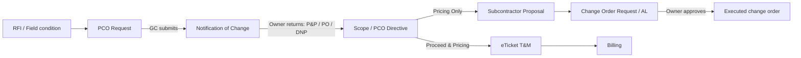
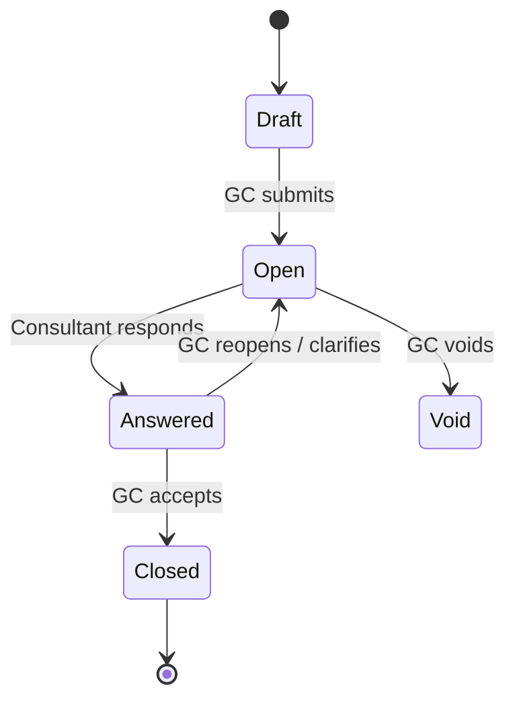
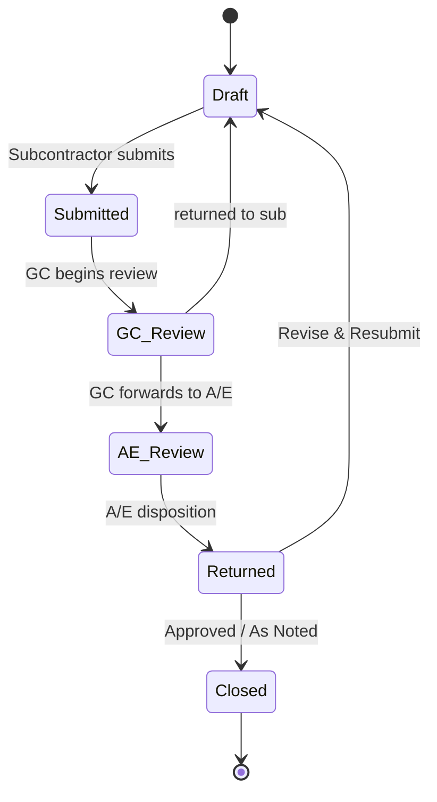

# eManager — General Contracting Portal for Mega Projects

**eManager** is a modular WordPress plugin that turns a WordPress site into a collaborative
portal for a major fast-track construction project — connecting the GC, owner, owner's
representative, consultants and subcontractors on one site. It digitizes the front-end
**change-order process end to end** and deploys role-tailored dashboards to each party.

Every business process (RFIs, Submittals, Daily Reports, PCO Requests, Change Orders, …) is
a **module** described by a single `module.json` file and stored in its **own table in the
WordPress database** (created automatically). One shared engine renders every module's
list / view / form pages and drives a **role-gated workflow state machine**, so adding a
module requires **no PHP and no build step**.

## How eManager runs a jobsite

```
   PRECONSTRUCTION        DESIGN / ENGINEERING            FIELD
   ┌───────────────┐      ┌───────────────────┐    ┌──────────────────────┐
   │ Prequalify     │     │ RFIs · Submittals  │    │ Daily reports + weather│
   │ Invite to bid  │ ──▶ │ Drawings · Specs   │──▶ │ Manpower/delivery logs │
   │ Level bids     │     │ Procurement (JIT)  │    │ Gantt + Line-of-Balance│
   │ Lock budget    │     │ Design reviews     │    │ Timesheets · Punch list│
   └───────┬───────┘      └─────────┬─────────┘     └───────────┬──────────┘
           │                        │                           │
           ▼                        ▼                           ▼
   ┌─────────────────────────────────────────────────────────────────────┐
   │  CHANGE MANAGEMENT (role-gated workflow, audit-logged)                │
   │  PCO Request ─▶ NOC ─▶ Directive ─▶ Proposal ─▶ COR/AL ─▶ eTicket     │
   │     field        owner    GC          sub         owner      T&M       │
   └───────────────────────────────┬─────────────────────────────────────┘
           ┌───────────────────────┼───────────────────────┐
           ▼                       ▼                        ▼
   ┌───────────────┐      ┌──────────────────┐     ┌──────────────────────┐
   │ QUALITY/SAFETY │     │ COST / FINANCIALS │     │ CLOSEOUT / HANDOVER   │
   │ Inspections    │     │ Budget · Commit.  │     │ Commissioning         │
   │ NCRs · Incidents│    │ Change events     │     │ As-builts · Training  │
   │ Toolbox talks  │     │ G702/G703 pay apps│     │ Completion certs      │
   │                │     │ Cost roll-up      │     │ Asset register        │
   └───────────────┘      └──────────────────┘      └──────────────────────┘
```

**A day on the project, in eManager:** the superintendent files the morning daily report
(site weather auto-fills) and logs manpower and deliveries from a phone; a foreman spots a
conflict and raises a **PCO request** with a photo — it routes to the owner as a
**Notification of Change**, comes back "Proceed & Pricing," becomes a **directive** to the
drywall sub, who prices it as a **proposal** that the GC reconciles into a **change-order
request** for the owner to approve, then bills the work on signed **eTickets**. Meanwhile QC
logs an **inspection** and an **NCR**, the PM answers two **RFIs**, accounting runs the
monthly **G702/G703 pay application**, and the **cost summary** shows budget vs. committed
vs. actual vs. forecast — every step stamped to an activity timeline.

## Workflow diagrams

**Change-order chain** — records hand off across modules, each step gated by the acting party's role:



**RFI lifecycle** (ball-in-court):



**Submittal review** (CSI disposition):



Every transition is gated by party role (GC · Owner · Owner's Rep · Consultant · Subcontractor)
and written to the record's activity timeline. See [docs/IMPROVEMENT-PLAN.md](docs/IMPROVEMENT-PLAN.md)
for the roadmap of bespoke build-outs across the remaining sections.

Implements the system described in provisional patent 514712205 ("PHP application built on
top of WordPress using a theme and set of plugins"), modernised as a standalone plugin.

---

## The change-order workflow

Records chain together through the construction process, each transition gated by the acting
party's role and recorded in an activity timeline:

```
PCO Request ─▶ NOC ─▶ Scope/PCO Directive ─┬─▶ Subcontractor Proposal ─▶ COR / Approval Letter
  (GC)        (Owner    (GC ▸ Subcontractor) │      (Sub ▸ GC reconcile)        (Owner approves)
            returns w/                        └─▶ eTicket (T&M) ─▶ Superintendent ─▶ GC sign
            P&P/PO/DNP)                              (auto-totalled from rate tables)
Supplemental Scope Info (SSI) ─▶ SSID        RFI: GC submits ─▶ Consultant answers
DCR: Subcontractor ─▶ GC reviews/approves
```

## Features

- **100+ built-in modules** across 14 sections (benchmarked against Procore / Autodesk
  Construction Cloud / Trimble e-Builder), including a dedicated **Change Management** section
  that implements the patent change-order workflow
- **AIA G702/G703 payment applications** — a Schedule of Values register with auto-computed
  G703 columns, plus a Pay Application builder that rolls the SOV up into a G702 certificate
  (retainage, previous certificates, current payment due, balance to finish) and exports the
  formatted G702 + G703 to PDF
- **Cost Summary** financial roll-up (budget vs. committed vs. actual vs. forecast, projected
  over/under)
- **Scheduling visuals** — a **Gantt** chart for the activity schedule and an Empire State
  Building-style **Line-of-Balance** chart for location-based/takt scheduling, plus
  just-in-time **Site Logistics** (crane/hoist/laydown booking) and a long-lead
  **Procurement Log**
- **Role-gated workflow engine** — server-enforced status transitions, direction handling
  (Proceed & Pricing / Pricing Only / Do Not Proceed), one-click record linking, and a full
  **activity audit trail** per record
- **Workflow collaboration tools** built on top of the engine:
  - **In-app workflow map** on every record (the full status path, with done / current / next steps)
  - **"In my court" queue** — a cross-module home list of every record awaiting an action you can take
  - **Related Records panel** — navigate the spawned-from (parent) / spawned (children) chain
  - **Transition data-gating** — a step can require fields be filled before it fires (server-enforced)
  - **Email notifications** on transitions to the record owner and the new ball-in-court party (`wp_mail`, opt-out per user, global toggle)
  - **Per-section permissions** — restrict each party role to specific sections (hidden in UI + blocked at REST)
  - **Auto-numbering** — leave a record number blank to get the next sequential value per module & project
  - **First-class lookups** — company/vendor and assignee fields autocomplete from Companies / project users
  - **Attachments** — file fields upload straight into the WordPress Media Library (strict type allowlist; executables blocked)
  - **Saved views & bulk actions** — save a list's filter/search/sort as a named view; select rows and delete in bulk (ownership still enforced)
- **Two role dimensions** — five CRUD capability roles *and* five project **party roles**
  (GC, Owner, Owner's Rep, Consultant, Subcontractor) that drive the workflow logic gates
  and tailored dashboards
- **Config-driven CRUD engine** — sortable & filterable tables, status filters, free-text
  search, pagination, Bootstrap 5 validated forms
- **eTicket T&M builder** — line items priced from the project labor/material/equipment rate
  tables, with automatic subtotals and grand total
- **Native WordPress database** — one custom table per module (plus shared tables for
  companies, comments and the activity log), created via `dbDelta` and indexed to stay fast
  at tens of thousands of records per module. No external services.
- **Five capability roles** with per-record ownership rules (see *Roles* below)
- **Comments** on every record; **PDF export** (jsPDF) of every record and list;
  **CSV export** of lists and reports
- **Electronic signatures** — draw-to-sign canvas pad (`signature` field type) on Daily
  Reports, Pre-Task Plans, Orientations, Lien Waivers and T&M Tickets; rendered in views
  and embedded in PDF exports
- **Reports** module with Chart.js statistics + PDF/CSV export
- **3D BIM viewer** — loads `.ifc` files with three.js / web-ifc-three, on demand
- **Daily Reports weather** — auto-filled from Open-Meteo for the project coordinates
- **ZIP module installer** — drop new modules in without touching the plugin
- **Front-end login & registration** pages (Bootstrap), company-per-user
- **Lightweight by design** — PHP renders only a shell; HTML partials (`.html`),
  JavaScript (`.js`) and CSS (`.css`) are separate, cacheable files fetched on demand

## Requirements

| | |
|---|---|
| WordPress | 6.4+ |
| PHP | 8.0+ |
| Database | The WordPress site database (MySQL/MariaDB) — no external services |
| Browser | Any modern evergreen browser |

## Installation

1. Copy the `emanager/` folder to `wp-content/plugins/` (or zip it and upload via
   *Plugins → Add New → Upload*).
2. Activate **eManager** in *Plugins*. Activation automatically:
   - adds the roles `em_administrator`, `em_editor`, `em_contributor`, `em_viewer`, `em_restricted`
   - creates three pages: **eManager Dashboard** (`[emanager]`), **eManager Login**
     (`[emanager_login]`), **eManager Register** (`[emanager_register]`)
   - **creates all database tables** — one per module plus shared tables (via `dbDelta`)
3. In WordPress go to **eManager → Settings** and enter the project information (name, number,
   address, **coordinates** for weather, dates). No connection setup is required.
4. Assign each user a role, **party role** and company under **eManager → Users**.
5. Open the **eManager Dashboard** page.

> Upgrading, or changed tables manually? **eManager → Settings → Rebuild tables** re-runs
> `dbDelta` (it only applies differences and never drops data). A MySQL reference of every
> table lives at [`schema/schema-reference.sql`](schema/schema-reference.sql), but you never
> need to run it by hand.

## Roles & permissions

| Role | Create | Read | Update | Delete |
|---|---|---|---|---|
| Administrator | ✔ | ✔ | ✔ | ✔ any record |
| Editor | ✔ | ✔ | ✔ | own records only |
| Contributor | ✔ | ✔ | — | own records only |
| Viewer | — | ✔ | — | — |
| Restricted | — | — | — | — |

- Any user who can create may delete **their own** records; only Administrators delete others'.
- WordPress administrators automatically have every eManager capability.
- Assign roles, **party roles** and companies under **eManager → Users**; manage companies
  under **eManager → Companies** (or in the dashboard's *Settings → Company Management* module).
- New self-registered users start as **Viewer** until upgraded.

### Party roles (workflow logic gates)

Separate from the CRUD capability roles above, each user is given a **party role** — their
position on the project org chart. Workflow transitions are gated by party role, so an Owner
only sees owner steps (returning NOCs, approving CORs), a Subcontractor only sees sub steps
(proposals, eTickets, DCRs), and so on. GC/administrators pass every gate so the workflow
never stalls.

| Party role | Drives |
|---|---|
| General Contractor | The whole process — raises PCOs, issues NOCs & directives, reconciles, signs |
| Owner | Returns NOCs with a direction; approves CORs / Approval Letters |
| Owner's Representative | Owner review steps, SSI |
| Consultant / Architect / Engineer | Answers RFIs; originates SSI |
| Subcontractor | Acknowledges directives; submits proposals, eTickets and DCRs |

## Sections & modules

100+ modules (102 today) across 14 sections covering the full project lifecycle:

| Section | Modules |
|---|---|
| Preconstruction | Qualified Bidders · Bid Packages · Bid Manual · Prequalification *(workflow)* · Bid Solicitations (ITB) · Bid Submissions (leveling) · Estimates · Value Engineering *(workflow)* |
| Engineering | RFIs *(ball-in-court workflow + aging KPIs, links to Change Events)* · Submittals *(Sub→GC→A/E review with dispositions + lead-time KPIs)* · Drawings & Specifications *(revision control)* · File Explorer · Permitting *(workflow)* · Meetings *(agenda→minutes, spawn action items)* · Transmittals *(workflow)* · Issues *(workflow)* · Action Items *(workflow)* · Correspondence · Design Reviews *(workflow)* · Procurement Log (long-lead / JIT) |
| **Change Management** | **PCO Requests · Notifications of Change · Supplemental Scope Info · Scope/PCO Directives · Subcontractor Proposals · Change Order Requests (COR/AL) · eTickets · Daily Construction Reports** — all workflow-driven and linked |
| Field | Daily Reports (weather) · Schedule *(Gantt chart)* · **Linear / Takt Schedule (Line-of-Balance chart)** · Photo Library · Checklists · Punchlist · Pull Planning · Timesheets *(workflow)* · Crews · Production Quantities · Manpower Log · Deliveries · Visitor Log · Equipment Log · Site Logistics |
| Quality | Inspections *(workflow)* · Non-Conformance Reports *(workflow)* · Deficiencies/Defects · Test Records |
| Safety | Observations · Pre-Task Plans · JHAs · Employee Orientations · Incidents *(workflow)* · Safety Violations · Toolbox Talks |
| Sustainability | LEED / Green Credits · Waste Diversion · Environmental Monitoring |
| Contracts | Prime Contract (GMP/Cost Plus/Lump Sum/CMAR) · Subcontracts · PSAs · Lien Waivers · COIs · Letters of Intent |
| Cost | **Cost Summary (roll-up dashboard)** · **Schedule of Values (G703)** · **Pay Applications (G702 builder + PDF)** · Budget & Forecast · Invoicing · Direct Costs · Potential Changes · Change Orders · Approval Letters & Directives · T&M Tickets · Commitments (POs) *(workflow)* · Change Events *(workflow)* · Owner Invoices *(workflow)* · Subcontractor Invoices *(workflow)* · Funding Sources · Allowances · Contingency Log |
| BIM | 3D Models (IFC viewer) · Coordination Issues |
| Closeout | O&M Manuals · Warranties · Attic Stock · Commissioning *(workflow)* · As-Builts · Owner Training · Completion Certificates *(workflow)* · Asset Register |
| Resources | Locations · CSI Divisions · Cost Codes · Labor Rates · Material Rates · Equipment Rates *(relational lookups used by other modules' forms)* |
| Settings | Project Info · Company Management · User Management · Project Help |
| Reports | Project Statistics (Chart.js, PDF + CSV export) |

The module set was benchmarked against Procore, Autodesk Construction Cloud and Trimble
e-Builder so the platform covers preconstruction & procurement, design/PM, quality, safety,
field productivity, the full cost/financial model, sustainability and handover.

## File structure

```
emanager/
├── emanager.php                     Plugin bootstrap (constants, hooks, table install)
├── uninstall.php                   Cleanup on uninstall (keeps data unless opted in)
├── README.md
├── docs/
│   └── MODULE-DEVELOPMENT.md       How to build & package modules
├── includes/                       PHP (server side)
│   ├── class-em-roles.php         Roles, capabilities, party roles, ownership
│   ├── class-em-db.php            $wpdb data layer + dbDelta table installer
│   ├── class-em-workflow.php      Role-gated workflow engine + activity log
│   ├── class-em-modules.php       Module registry (scans module.json files)
│   ├── class-em-installer.php     ZIP module installer (no-PHP policy, creates table)
│   ├── class-em-api.php           REST API: CRUD, workflow, comments, weather, stats
│   ├── class-em-auth.php          Login/registration shortcodes, guards
│   ├── class-em-public.php        [emanager] shortcode + asset loading
│   └── class-em-admin.php         WP-Admin settings screens
├── admin/
│   ├── views/                      settings.php · users.php · companies.php · modules.php
│   ├── css/em-admin.css
│   └── js/em-admin.js
├── public/
│   ├── partials/                   header.html · navbar.html · sidebar.html ·
│   │                               footer.html · home.html · login.html · register.html
│   ├── css/                        emanager.css · em-auth.css
│   └── js/                         em-api.js (REST client) · em-templates.js (loader)
│                                   em-table.js (lists) · em-form.js (forms)
│                                   em-view.js (records+comments) · em-pdf.js · em-app.js (router)
├── modules/
│   ├── sections.json               Section order, names, icons
│   ├── _defaults/                  Shared list.html · view.html · form.html
│   └── <section>/<module-id>/      module.json (+ optional module.js, module.css,
│                                   list/view/form.html overrides)
├── schema/
│   └── schema-reference.sql        MySQL reference (informational; tables auto-created)
└── languages/                      Translations (text domain: emanager)
```

User-installed modules live in `wp-content/uploads/emanager-modules/<section>/<id>/`
so plugin updates never remove them.

## Architecture

- **PHP renders a shell only.** The `[emanager]` page outputs one `<div>`; the JS app
  fetches the separated HTML partials (header / navbar / sidebar / footer) in parallel and
  routes by URL hash (`#/engineering/rfis/view/<id>`). Partials and templates are static
  `.html` files — cacheable by the browser and any CDN.
- **One engine, many modules.** `em-table.js`, `em-form.js` and `em-view.js` render any
  module from its `module.json`. A module may override any template or take over rendering
  entirely with `EM.registerModule()` (see the Reports and BIM modules).
- **Security.** All data flows browser → WP REST (cookie + nonce auth, capability checks,
  party-role workflow gates, field whitelisting/sanitization) → `EM_DB` → MySQL. Every query
  goes through `$wpdb->prepare()`; table/column identifiers are whitelisted to `[a-z0-9_]`.
  Module ZIPs may not contain PHP.
- **Scale.** Each module has its own table with indexes on `status`, `created_at`,
  `created_by`, `(project_id, status)`, the linked-record back-reference, and every
  list/sortable column — keeping list, filter and report queries fast at tens of thousands
  of rows per module. Reports use a single indexed `GROUP BY` per table.
- **Performance.** Bootstrap/jsPDF/Chart.js are bundled locally and load only on the
  dashboard page; three.js loads only when a 3D model is opened; `module.js`/`module.css`
  load only when their module is first visited.

## Creating modules

See [docs/MODULE-DEVELOPMENT.md](docs/MODULE-DEVELOPMENT.md). Short version: a module is a
folder with a `module.json` declaring fields and statuses; zip it; upload under
**eManager → Modules** — its database table is created automatically. Done.

## REST API

Namespace `em/v1` (cookie + `X-WP-Nonce` auth):

```
GET    /boot                                  registry (section-filtered), user, caps, project, flags
GET    /modules/{module}/records              ?sort=&order=&page=&per_page=&search=&status=&filters[col]=
POST   /modules/{module}/records              create (auto-numbers, seeds activity)
GET    /modules/{module}/records/{id}         read (includes _links: parent/children)
PUT    /modules/{module}/records/{id}         update
DELETE /modules/{module}/records/{id}         delete (ownership enforced)
GET    /modules/{module}/records/{id}/comments
POST   /modules/{module}/records/{id}/comments
GET    /modules/{module}/records/{id}/activity   workflow/audit timeline
POST   /modules/{module}/records/{id}/transition status change (party + cap gated, requires-checked)
POST   /modules/{module}/records/{id}/spawn      create a linked record from a relation
GET    /my-court                              records awaiting an action you can take
GET    /views   ·  POST /views               saved list views (per user, per module)
POST   /upload                                file → Media Library (type allowlist, no PHP)
GET    /users                                 project users (assignee lookups)
GET    /weather?lat=&lon=                     Open-Meteo proxy (cached 1 h)
GET    /reports/stats                         counts per module & status
GET    /reports/cost-summary                  budget vs. committed vs. actual vs. forecast roll-up
POST   /modules/install                       ZIP install (admins)
DELETE /modules/{module}                      uninstall custom module (admins)
```

## License

GPL-2.0-or-later.
